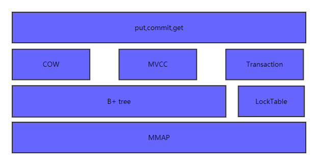
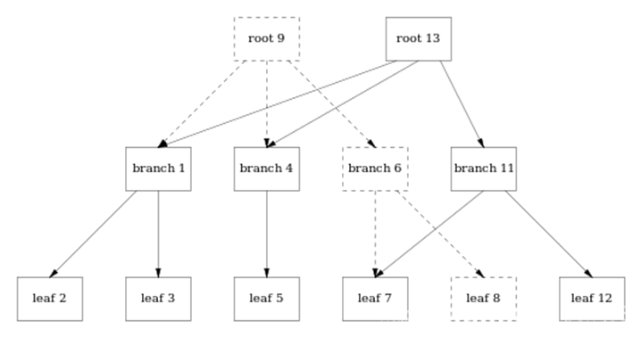

# [python（八）：python使用lmdb数据库](https://www.cnblogs.com/zhangxianrong/p/14919706.html)

## 一、入门代码

LMDB的全称是Lightning Memory-Mapped Database(快如闪电的内存映射数据库)，它的文件结构简单，包含一个数据文件和一个锁文件：


LMDB文件可以同时由多个进程打开，具有极高的数据存取速度，访问简单，不需要运行单独的数据库管理进程，只要在访问数据的代码里引用LMDB库，访问时给文件路径即可。

让系统访问大量小文件的开销很大，而LMDB使用内存映射的方式访问文件，使得文件内寻址的开销非常小，使用指针运算就能实现。数据库单文件还能减少数据集复制/传输过程的开销。

在python中使用lmdb： linux中，可以使用指令‘pip install lmdb' 安装lmdb包。

1. 生成一个空的lmdb数据库文件

```python
# -*- coding: utf-8 -*- 
import lmdb 
  
# 如果train文件夹下没有data.mbd或lock.mdb文件，则会生成一个空的，如果有，不会覆盖 
# map_size定义最大储存容量，单位是kb，以下定义1TB容量 
env = lmdb.open("./train"，map_size=1099511627776) 
env.close()
```

2. LMDB数据的添加、修改、删除

```python
# -*- coding: utf-8 -*- 
import lmdb 
  
# map_size定义最大储存容量，单位是kb，以下定义1TB容量 
env = lmdb.open("./train", map_size=1099511627776) 
  
txn = env.begin(write=True) 
  
# 添加数据和键值 
txn.put(key = '1', value = 'aaa') 
txn.put(key = '2', value = 'bbb') 
txn.put(key = '3', value = 'ccc') 
  
# 通过键值删除数据 
txn.delete(key = '1') 
  
# 修改数据 
txn.put(key = '3', value = 'ddd') 
  
# 通过commit()函数提交更改 
txn.commit() 
env.close()
```

3. 查询lmdb数据库内容

```python
# -*- coding: utf-8 -*- 
import lmdb 
  
env = lmdb.open("./train") 
  
# 参数write设置为True才可以写入 
txn = env.begin(write=True) 
############################################添加、修改、删除数据 
  
# 添加数据和键值 
txn.put(key = '1', value = 'aaa') 
txn.put(key = '2', value = 'bbb') 
txn.put(key = '3', value = 'ccc') 
  
# 通过键值删除数据 
txn.delete(key = '1') 
  
# 修改数据 
txn.put(key = '3', value = 'ddd') 
  
# 通过commit()函数提交更改 
txn.commit() 
############################################查询lmdb数据 
txn = env.begin() 
  
# get函数通过键值查询数据 
print txn.get(str(2)) 
  
# 通过cursor()遍历所有数据和键值 
for key, value in txn.cursor(): 
  print (key, value) 
    
############################################ 
  
env.close()
```

4. 读取已有.mdb文件内容

```python
# -*- coding: utf-8 -*- 
import lmdb 
  
env_db = lmdb.Environment('trainC') 
# env_db = lmdb.open("./trainC") 
  
txn = env_db.begin() 
  
# get函数通过键值查询数据,如果要查询的键值没有对应数据，则输出None 
print txn.get(str(200)) 
  
for key, value in txn.cursor(): #遍历 
  print (key, value) 
  
env_db.close()
```

## 二、进阶

### LMDB 介绍

 

LMDB 全称为 Lightning Memory-Mapped Database，就是非常快的内存映射型数据库，LMDB使用内存映射文件，可以提供更好的输入/输出性能，对于用于神经网络的大型数据集( 比如 [ImageNet](https://link.zhihu.com/?target=http%3A//image-net.org/) )，可以将其存储在 LMDB 中。

 

因为最开始 Caffe 就是使用的这个数据库，所以网上的大多数关于 LMDB 的教程都通过 Caffe 实现的，对于不了解 Caffe 的同学很不友好，所以本篇文章只讲解 LMDB。

 

LMDB属于key-value数据库，而不是关系型数据库( 比如 MySQL )，LMDB提供 key-value 存储，其中每个键值对都是我们数据集中的一个样本。LMDB的主要作用是提供数据管理，可以将各种各样的原始数据转换为统一的key-value存储。

 

LMDB效率高的一个关键原因是它是基于内存映射的，这意味着它返回指向键和值的内存地址的指针，而不需要像大多数其他数据库那样复制内存中的任何内容。

 

LMDB不仅可以用来存放训练和测试用的数据集，还可以存放神经网络提取出的特征数据。如果数据的结构很简单，就是大量的矩阵和向量，而且数据之间没有什么关联，数据内没有复杂的对象结构，那么就可以选择LMDB这个简单的数据库来存放数据。

 

LMDB的文件结构很简单，一个文件夹，里面是一个数据文件和一个锁文件。数据随意复制，随意传输。它的访问简单，不需要单独的数据管理进程。只要在访问代码里引用LMDB库，访问时给文件路径即可。

 

用LMDB数据库来存放图像数据，而不是直接读取原始图像数据的原因：

- 数据类型多种多样，比如：二进制文件、文本文件、编码后的图像文件jpeg、png等，不可能用一套代码实现所有类型的输入数据读取，因此通过LMDB数据库，转换为统一数据格式可以简化数据读取层的实现。
- lmdb具有极高的存取速度，大大减少了系统访问大量小文件时的磁盘IO的时间开销。LMDB将整个数据集都放在一个文件里，避免了文件系统寻址的开销，你的存储介质有多快，就能访问多快，不会因为文件多而导致时间长。LMDB使用了内存映射的方式访问文件，这使得文件内寻址的开销大幅度降低。

 

 

### LMDB 的基本函数

- `env = lmdb.open()`：创建 lmdb 环境
- `txn = env.begin()`：建立事务
- `txn.put(key, value)`：进行插入和修改
- `txn.delete(key)`：进行删除
- `txn.get(key)`：进行查询
- `txn.cursor()`：进行遍历
- `txn.commit()`：提交更改

 

创建一个 lmdb 环境：

```python
# 安装：pip install lmdb
import lmdb

env = lmdb.open(lmdb_path, map_size=1099511627776)
```

`lmdb_path` 指定存放生成的lmdb数据库的文件夹路径，如果没有该文件夹则自动创建。

 

`map_size` 指定创建的新数据库所需磁盘空间的最小值，1099511627776B＝１T。可以在这里进行 [存储单位换算](https://link.zhihu.com/?target=https%3A//cunchu.51240.com/)。

 

会在指定路径下创建 `data.mdb` 和 `lock.mdb` 两个文件，一是个数据文件，一个是锁文件。

 

修改数据库内容：

```python
txn = env.begin(write=True)

# insert/modify
txn.put(str(1).encode(), "Alice".encode())
txn.put(str(2).encode(), "Bob".encode())

# delete
txn.delete(str(1).encode())

txn.commit()
```

先创建一个事务(transaction) 对象 `txn`，所有的操作都必须经过这个事务对象。因为我们要对数据库进行写入操作，所以将 `write` 参数置为 `True`，默认其为 `False`。

 

使用 `.put(key, value)` 对数据库进行插入和修改操作，传入的参数为键值对。

 

值得注意的是，需要在键值字符串后加 `.encode()` 改变其编码格式，将 `str` 转换为 `bytes` 格式，否则会报该错误：`TypeError: Won't implicitly convert Unicode to bytes; use .encode()`。在后面使用 `.decode()` 对其进行解码得到原数据。

 

使用 `.delete(key)` 删除指定键值对。

 

对LMDB的读写操作在事务中执行，需要使用 `commit` 方法提交待处理的事务。

 

查询数据库内容：

```python
txn = env.begin()

print(txn.get(str(2).encode()))

for key, value in txn.cursor():
    print(key, value)

env.close()
```

每次 `commit()` 之后都要用 `env.begin()` 更新 txn（得到最新的lmdb数据库）。

 

使用 `.get(key)` 查询数据库中的单条记录。

 

使用 `.cursor()` 遍历数据库中的所有记录，其返回一个可迭代对象，相当于关系数据库中的游标，每读取一次，游标下移一位。

 

也可以想文件一样使用 `with` 语法：

```python
with env.begin() as txn:
    print(txn.get(str(2).encode()))

    for key, value in txn.cursor():
        print(key, value)
```

 

完整的demo如下：

```python
import lmdb
import os, sys

def initialize():
    env = lmdb.open("lmdb_dir")
    return env

def insert(env, sid, name):
    txn = env.begin(write=True)
    txn.put(str(sid).encode(), name.encode())
    txn.commit()

def delete(env, sid):
    txn = env.begin(write=True)
    txn.delete(str(sid).encode())
    txn.commit()

def update(env, sid, name):
    txn = env.begin(write=True)
    txn.put(str(sid).encode(), name.encode())
    txn.commit()

def search(env, sid):
    txn = env.begin()
    name = txn.get(str(sid).encode())
    return name

def display(env):
    txn = env.begin()
    cur = txn.cursor()
    for key, value in cur:
        print(key, value)


env = initialize()

print("Insert 3 records.")
insert(env, 1, "Alice")
insert(env, 2, "Bob")
insert(env, 3, "Peter")
display(env)

print("Delete the record where sid = 1.")
delete(env, 1)
display(env)

print("Update the record where sid = 3.")
update(env, 3, "Mark")
display(env)

print("Get the name of student whose sid = 3.")
name = search(env, 3)
print(name)

# 最后需要关闭关闭lmdb数据库
env.close()

# 执行系统命令
os.system("rm -r lmdb_dir")
```

 

### 图片数据示例

在图像深度学习训练中我们一般都会把大量原始数据集转化为lmdb格式以方便后续的网络训练。因此我们也需要对该数据集进行lmdb格式转化。

 

将图片和对应的文本标签存放到lmdb数据库：

```python
import lmdb

image_path = './cat.jpg'
label = 'cat'

env = lmdb.open('lmdb_dir')
cache = {}  # 存储键值对

with open(image_path, 'rb') as f:
    # 读取图像文件的二进制格式数据
    image_bin = f.read()

# 用两个键值对表示一个数据样本
cache['image_000'] = image_bin
cache['label_000'] = label

with env.begin(write=True) as txn:
    for k, v in cache.items():
        if isinstance(v, bytes):
            # 图片类型为bytes
            txn.put(k.encode(), v)
        else:
            # 标签类型为str, 转为bytes
            txn.put(k.encode(), v.encode())  # 编码

env.close()
```

这里需要获取图像文件的二进制格式数据，然后用两个键值对保存一个数据样本，即分开保存图片和其标签。

 

然后分别将图像和标签写入到lmdb数据库中，和上面例子一样都需要将键值转换为 `bytes` 格式。因为此处读取的图片格式本身就为 `bytes`，所以不需要转换，标签格式为 `str`，写入数据库之前需要先进行编码将其转换为 `bytes`。

 

从lmdb数据库中读取图片数据：

```python
import cv2
import lmdb
import numpy as np

env = lmdb.open('lmdb_dir')

with env.begin(write=False) as txn:
    # 获取图像数据
    image_bin = txn.get('image_000'.encode())
    label = txn.get('label_000'.encode()).decode()  # 解码

    # 将二进制文件转为十进制文件（一维数组）
    image_buf = np.frombuffer(image_bin, dtype=np.uint8)
    # 将数据转换(解码)成图像格式
    # cv2.IMREAD_GRAYSCALE为灰度图，cv2.IMREAD_COLOR为彩色图
    img = cv2.imdecode(image_buf, cv2.IMREAD_COLOR)
    cv2.imshow('image', img)
    cv2.waitKey(0)
```

先通过 `lmdb.open()` 获取之前创建的lmdb数据库。

 

这里通过键得到图片和其标签，因为写入数据库之前进行了编码，所以这里需要先解码。

- 标签通过 `.decode()` 进行解码重新得到字符串格式。
- 读取到的图片数据为二进制格式，所以先使用 `np.frombuffer()` 将其转换为十进制格式的文件，这是一维数组。然后可以使用 `cv2.imdecode()` 将其转换为灰度图（二维数组）或者彩色图（三维数组）。

## 三、原理

- Linux内存布局

- - 低址到高址分别是Text segment（代码段），数据段（已初始化的全局，静态变量），BSS段（未初始化的全局，静态变量），堆，内存映射区以及栈。

  - 内存分配的两种方式：

  - - brk

    - - brk是将数据段(.data)的最高地址指针_edata往高地址推。
      - malloc小于128k的内存，使用brk分配内存。
      - brk分配的内存需要等到高地址内存释放以后才能释放。

    - mmap

    - - mmap是在进程的虚拟地址空间中（堆和栈中间，称为文件映射区域的地方）找一块空闲的虚拟内存。
      - malloc大于128k的内存，使用mmap分配内存。
      - mmap分配的内存可以单独释放。

  - 这两种方式分配的都是虚拟内存，没有分配物理内存。在第一次访问已分配的虚拟地址空间的时候，发生缺页中断，操作系统负责分配物理内存，然后建立虚拟内存和物理内存之间的映射关系。


 

- - LMDB（Lightning Memory-Mapped Database）是一个小型数据库，具有一些强大的功能：

  - - 有序映射接口（键始终排序，支持范围查找）

    - 带有MVCC（多版本并发控制）的完全事务性，完全ACID（原子性，一致性，隔离性，耐久性）语义。

    - 读者/写者事务：读者不会阻止写者，写者也不会阻止读者。

    - - 写入程序已完全序列化，因此写入始终无死锁。

    - 读事务非常低开销，可以不使用malloc或任何其他阻塞调用来执行。

    - 支持多线程和多进程并发，环境可以由同一主机上的多个进程打开。

    - 可以创建多个子数据库，其中事务覆盖所有子数据库。

    - 内存映射，允许零拷贝查找和迭代。

    - 免维护，无需外部过程或后台清理/压缩。

    - 防崩溃，无需日志或崩溃恢复过程。

    - 没有应用程序级缓存。

    - - LMDB充分利用了操作系统的缓冲区高速缓存。

    - 32KB的目标代码和C的6KLOC。

 

- LMDB的基本结构



 

- - 内存映射（Memory Map）

  - - 内存映射就是把物理内存映射到进程的地址空间之内，这些应用程序就可以直接使用输入输出的地址空间。

    - - 使用内存映射文件处理存储于磁盘上的文件时，将不需要由应用程序对文件执行I/O操作，这意味着在对文件进行处理时将不必再为文件申请并分配缓存，所有的文件缓存操作均由系统直接管理，由于取消了将文件数据加载到内存、数据从内存到文件的回写以及释放内存块等步骤，使得内存映射文件在处理大数据量的文件时能起到相当重要的作用。

 

- - 一般文件的io过程（两次数据拷贝）

1. 首先调用read()（系统调用）先将文件内容从硬盘拷贝到内核空间的一个缓冲区（一次数据拷贝）。
2. 然后再将这些数据拷贝到用户空间。（一次数据拷贝）

- 内存映射的文件io过程（一次数据拷贝）

1. 调用mmap()（系统调用）分配逻辑地址。
2. 逻辑地址转换成物理地址。
3. 进程第一次访问ptr指向的内存地址，发生缺页中断。由中断处理函数将数据拷贝到相应的内存地址上。（一次数据拷贝）
4. 虚拟地址置换。

- - lmdb使用mmap文件映射,不管这个文件存储实在内存上还是在持久存储上。

  - - lmdb的所有读取操作都是通过mmap将要访问的文件只读的映射到虚拟内存中，直接访问相应的地址。

    - 因为使用了read-only的mmap，同样避免了程序错误将存储结构写坏的风险。

    - 写操作，则是通过write系统调用进行的，这主要是为了利用操作系统的文件系统一致性，避免在被访问的地址上进行同步。

    - lmdb把整个虚拟存储组织成B+Tree存储,索引和值读存储在B+Tree的页面上（聚集索引）。

    - LMDB中使用append-only B+树，其更新操作最终都会转换为B+树的物理存储的append操作，文件不支持内部的修改，只支持append。

    - - append增加了存储开销，因为旧的数据依然存在。带来一个额外的好处就是，旧的链路依然存在，依然可以正常的访问，例如过去有个人持有了过去的root（root9）的指针，那么过去的整棵树都完整的存在。



- - COW(Copy-on-write)写时复制

  - - 如果有多个调用者（callers）同时要求相同资源（如内存或磁盘上的数据存储），他们会共同获取相同的指针指向相同的资源，直到某个调用者试图修改资源的内容时，系统才会真正复制一份专用副本（private copy）给该调用者，而其他调用者所见到的最初的资源仍然保持不变。

    - 因此多个调用者只是读取操作时可以共享同一份资源。

    - 优点

    - - 如果调用者没有修改该资源，就不会有副本（private copy）被创建。

 

- 当前读

- - 读取的是记录的最新版本，读取时还要保证其他并发事务不能修改当前记录，会对读取的记录进行加锁。

  - - 例如select lock in share mode(共享锁), select for update ; update, insert ,delete(排他锁)这些操作都是一种当前读

- 快照读

- - 快照读的实现是基于多版本并发控制，即MVCC，避免了加锁操作，降低了开销。

- - MVCC(Multiversion concurrency control )多版并发本控制

  - - 当MVCC数据库需要更新数据项时，它不会用新数据覆盖旧数据，而是将旧数据标记为已过时并在其他位置添加新版本。

    - - 因此存储了多个版本，但只有一个是最新版本。

    - MVCC通过保存数据的历史版本，根据比较版本号来处理数据的是否显示，从而达到读取数据的时候不需要加锁就可以保证事务隔离性的效果。

    - 数据库系统维护当前活跃的事务ID列表m_ids，其中最小值up_limit_id和最大值low_limit_id，被访问的事务ID：trx_id。

    - - 如果trx_id< up_limit_id，说明trx_id对应的事务在生成可读视图前已经被提交了，可以被当前事务访问
      - 如果trx_id> low_limit_id，说明事务trx_id生成可读视图后才生成的，所以不可以被当前事务访问到。
      - 如果up_limit_id <=trx_id<= low_limit_id，判断trx_id是否在m_ids中，若在，则说明trix_id在生成可读视图时还处于活跃，不可以被访问到；弱国不在m_ids中，说明在生成可读视图时该事务已经被提交了，故可以被访问到。

 

- MVCC/COW在LMDB中的实现

- - LMDB对MVCC加了一个限制，即只允许一个写线程存在，从根源上避免了写写冲突，当然代价就是写入的并发性能下降。

  - - 因为只有一个写线程，所以不会不需要wait日志、读写依赖队列、锁队列等一系列控制并发、事务回滚、数据恢复的基础工具。

  - MVCC的基础就是COW，对于不同的用户来说，若其在整个操作过程中不进行任何的数据改变，其就使用同一份数据即可。若需要进行改变，比如增加、删除、修改等，就需要在私有数据版本上进行，修改完成提交之后才给其他事务可见。

- - LMDB的事务实现

  - - Atom（A）原子性：LMDB中通过txn数据结构和cursor数据结构的控制，通过将脏页列表放入 dirtylist中，当txn进行提交时再一次性统一刷新到磁盘中或者abort时都不提交保证事务要不全成功、要不全失败。对于长事务，若页面spill到磁盘，因为COW技术，这些页面未与整棵B-Tree的rootpage产生关联，因此后续的事务还是不能访问到这些页面，同样保证了事务的原子性。

    - Consistency(C)一致性： 有如上的操作,保证其数据就是一致的，不存在因为多线程同时写数据导致数据产生错误的情况。

    - Isolation（I）隔离性：事务隔离通过锁控制（MUTEX），LMDB支持的锁互斥是进程级别/线程级别，支持的隔离方式为锁表支持，读读之间不锁，写等待读完成之后开始，读等待写完成后开始。

    - Duration（D）持久性：，没有使用WAL、undo/redo log等技术来保证系统崩溃时数据库的可用性，其保证数据持续可用的技术是COW技术和只有一线程写技术。

    - - 假如LMDB或者系统崩溃时，只有读操作，那么数据本来就没有发生变化，因此数据将不可能遭到破坏。假如崩溃时，有一个线程在进行写操作，则只需要判断最后的页面号与成功提交到数据库中的页面号是否一致，若不一致则说明写操作没有完成，则最后一个事务写失败，数据在最后一个成功的页面前的是正确的，后续的属于崩溃事务的，不能用，这样就保证了数据只要序列化到磁盘则一定可用，要不其就是还没有遵循ACI原则序列化到磁盘。

 

- 聚集索引和辅助索引

- - 聚集索引

  - - 指索引项的排序方式和表中数据记录排序方式一致的索引，每张表只能有一个聚集索引，聚集索引的叶子节点存储了整个行数据。

    - - 如果一个主键被定义了，那么这个主键就是作为聚集索引。
      - 如果没有主键被定义，那么该表的第一个唯一非空索引被作为聚集索引。
      - 如果没有主键也没有合适的唯一索引，那么innodb内部会生成一个隐藏的主键作为聚集索引，这个隐藏的主键是一个6个字节的列，该列的值会随着数据的插入自增。

    - 由于实际的数据页只能按照一颗B+树进行排序，因此每张表只能有一个聚集索引。

  - 辅助索引

  - - 一个表中的所有索引除了聚集索引，其他的都是二级（辅助）索引（secondary index）。
    - 辅助索引，其叶子节点并不包含行记录的全部数据，叶子结点除了包含键值以外，每个叶子结点中的索引行还包含了一个书签，该书签用来告诉存储引擎可以在哪找到相应的数据行，由于innodb引擎表是索引组织表，因此innodb存储引擎的辅助索引的书签就是相应行数据的聚集索引键，

- 示例代码

```python
import lmdb
# map_size定义最大储存容量，单位是kb，以下定义1TB容量
env = lmdb.open("./train", map_size=1099511627776)

# 参数write设置为True才可以写入
txn = env.begin(write=True) # 开启事务

# 通过cursor()遍历所有数据和键值
for key, value in txn.cursor():
        print (key, value)

# 添加数据和键值
txn.put(key = '1', value = 'aaa')
txn.put(key = '2', value = 'bbb')
txn.put(key = '3', value = 'ccc')

# 通过键值删除数据
txn.delete(key = '1')

# 修改数据
txn.put(key = '3', value = 'ddd')

# 通过commit()函数提交更改
txn.commit()                        # 提交事务

env.close()         # 关闭事务
```

------

### HDF5

HDF5 (Hierarchical Data Format) 是一种常见的跨平台数据储存文件，可以存储不同类型的图像和数码数据，并且可以在不同类型的机器上传输，同时还有统一处理这种文件格式的函数库。

- HDF5 文件结构中有 2 primary objects:

- - Groups

  - - 类似于文件夹，每个 HDF5 文件其实就是根目录 (root)为 group'/'

  - Datasets

  - - 类似于 NumPy 中的数组 array

    - 每个 dataset 可以分成两部分

    - - 原始数据 (raw) data values

      - 元数据 metadata

      - - 描述并提供有关其他数据的信息的数据

- 整个HDF5结构

```text
+-- /
|     +-- group_1
|     |     +-- dataset_1_1
|     |     |     +-- attribute_1_1_1
|     |     |     +-- attribute_1_1_2
|     |     |     +-- ...
|     |     |
|     |     +-- dataset_1_2
|     |     |     +-- attribute_1_2_1
|     |     |     +-- attribute_1_2_2
|     |     |     +-- ...
|     |     |
|     |     +-- ...
|     |
|     +-- group_2
|     |     +-- dataset_2_1
|     |     |     +-- attribute_2_1_1
|     |     |     +-- attribute_2_1_2
|     |     |     +-- ...
|     |     |
|     |     +-- dataset_2_2
|     |     |     +-- attribute_2_2_1
|     |     |     +-- attribute_2_2_2
|     |     |     +-- ...
|     |     |
|     |     +-- ...
|     |
|     +-- ...
|
```

- HDF5的特性

- - 自述性

  - - 对于一个HDF 文件里的每一个数据对象，有关于该数据的综合信息（元数据）

    - - 在没有任何外部信息的情况下，HDF 允许应用程序解释HDF文件的结构和内容。

  - 通用性

  - - 许多数据类型都可以被嵌入在一个HDF文件里

    - - 例如，通过使用合适的HDF 数据结构，符号、数字和图形数据可以同时存储在一个HDF 文件里。

  - 灵活性

  - - HDF允许用户把相关的数据对象组合在一起，放到一个分层结构中，向数据对象添加描述和标签。
    - 它还允许用户把科学数据放到多个HDF 文件里。

  - 扩展性

  - - HDF极易容纳将来新增加的数据模式，容易与其他标准格式兼容。

  - 跨平台性

  - - HDF 是一个与平台无关的文件格式。HDF 文件无需任何转换就可以在不同平台上使用。

## 四、pytorch使用

转：https://blog.csdn.net/P_LarT/article/details/103208405

https://www.yuque.com/lart/ugkv9f/hbnym1

文章https://blog.csdn.net/jyl1999xxxx/article/details/53942824中介绍了使用LMDB的原因：

Caffe使用LMDB来存放训练/测试用的数据集，以及使用网络提取出的feature（为了方便，以下还是统称数据集）。数据集的结构很简单，就是大量的矩阵/向量数据平铺开来。数据之间没有什么关联，数据内没有复杂的对象结构，就是向量和矩阵。既然数据并不复杂，Caffe就选择了LMDB这个简单的数据库来存放数据。

图像数据集归根究底从图像文件而来。引入数据库存放数据集，是为了减少IO开销。读取大量小文件的开销是非常大的，尤其是在机械硬盘上。LMDB的整个数据库放在一个文件里，避免了文件系统寻址的开销。LMDB使用内存映射的方式访问文件，使得文件内寻址的开销非常小，使用指针运算就能实现。数据库单文件还能减少数据集复制/传输过程的开销。一个几万，几十万文件的数据集，不管是直接复制，还是打包再解包，过程都无比漫长而痛苦。LMDB数据库只有一个文件，你的介质有多块，就能复制多快，不会因为文件多而慢如蜗牛。

在文章http://shuokay.com/2018/05/14/python-lmdb/中类似提到：

为什么要把图像数据转换成大的二进制文件？

简单来说，是**因为读写小文件的速度太慢**。那么，不禁要问，图像数据也是二进制文件，单个大的二进制文件例如 LMDB 文件也是二进制文件，为什么单个图像读写速度就慢了呢？这里分两种情况解释。

1. 机械硬盘的情况：机械硬盘的每次读写启动时间比较长，例如磁头的寻道时间占比很高，因此，如果单个小文件读写，尤其是随机读写单个小文件的时候，这个寻道时间占比就会很高，最后导致大量读写小文件的时候时间会很浪费；
2. NFS 的情况：在 NFS 的场景下，系统的一次读写首先要进行上百次的网络通讯，并且这个通讯次数和文件的大小无关。因此，如果是读写小文件，这个网络通讯时间占据了整个读写时间的大部分。

固态硬盘的情况下应该也会有一些类似的开销，目前没有研究过。

 

总而言之，使用LMDB可以为我们的数据读取进行加速。

 

## 具体操作

 

### LMDB主要类

 

```
pip install imdb
```

 

#### `lmdb.Environment`

 

`lmdb.open()` class lmdb.Environment(path, map_size=10485760, subdir=True, readonly=False, metasync=True, sync=True, map_async=False, mode=493, create=True, readahead=True, writemap=False, meminit=True, max_readers=126, max_dbs=0, max_spare_txns=1, lock=True)https://lmdb.readthedocs.io/en/release/#environment-class

 

这是数据库环境的结构。 一个环境可能包含多个数据库，所有数据库都驻留在同一共享内存映射和基础磁盘文件中。

几个重要的实例方法：

-  begin(db=None, parent=None, write=False, buffers=False): 可以调用事务类 `lmdb.Transaction` open_db(key=None, txn=None, reverse_key=False, dupsort=False, create=True, integerkey=False, integerdup=False, dupfixed=False): 打开一个数据库，返回一个不透明的句柄。重复`Environment.open_db()` 调用相同的名称将返回相同的句柄。作为一个特殊情况，主数据库总是开放的。命名数据库是通过在主数据库中存储一个特殊的描述符来实现的。环境中的所有数据库共享相同的文件。因为描述符存在于主数据库中，所以如果已经存在与数据库名称匹配的 `key` ，创建命名数据库的尝试将失败。此外，查找和枚举可以看到`key` 。如果主数据库`keyspace`与命名数据库使用的名称冲突，则将主数据库的内容移动到另一个命名数据库。

 

```
>>> env = lmdb.open('/tmp/test', max_dbs=2)
>>> with env.begin(write=True) as txn
...     txn.put('somename', 'somedata')
>>> # Error: database cannot share name of existing key!
>>> subdb = env.open_db('somename')
```

 

#### `lmdb.Transaction`

 

这和事务对象有关。

 

`class lmdb.Transaction(env, db=None, parent=None, write=False, buffers=False)` 。

 

关于这个类的参数：https://lmdb.readthedocs.io/en/release/#transaction-class

 

所有操作都需要事务句柄，事务可以是只读或读写的。写事务可能不会跨越线程。事务对象实现了上下文管理器协议，因此即使面对未处理的异常，也可以可靠地释放事务：

 

```
# Transaction aborts correctly:
with env.begin(write=True) as txn:
   crash()
# Transaction commits automatically:
with env.begin(write=True) as txn:
   txn.put('a', 'b')
```

 

这个类的实例包含着很多有用的操作方法。

 

- abort(): 中止挂起的事务。重复调用 `abort()` 在之前成功的 `commit()` 或 `abort()` 后或者在相关环境关闭后是没有效果的。
- 提交挂起的事务。

- Shortcut for `lmdb.Cursor(db, self)` 
- delete(key, value='', db=None): Delete a key from the database.

- The key to delete.
- value:如果数据库是以 `dupsort = True` 打开的，并且 `value` 不是空的 `bytestring` ，则删除仅与此 `(key, value)` 对匹配的元素，否则该 `key` 的所有值都将被删除。

- Returns `True` if at least one key was deleted.

- cursors
- pop(key, db=None): 使用临时cursor调用 `Cursor.pop()` 。

- 
- put(key, value, dupdata=True, overwrite=True, append=False, db=None): 存储一条记录(record)，如果记录被写入，则返回 `True` ，否则返回 `False` ，以指示key已经存在并且 `overwrite = False` 。成功后，cursor位于新记录上。

- key: Bytestring key to store.
- value: Bytestring value to store.

- dupdata: 如果 `True` ，并且数据库是用 `dupsort = True` 打开的，如果给定 `key` 已经存在，则添加键值对作为副本。否则覆盖任何现有匹配的 `key` 。
- overwrite: 
- append: 如果为 `True` ，则将对附加到数据库末尾，而不首先比较其顺序。附加不大于现有最高 `key` 的 `key` 将导致损坏。
- db: 要操作的命名数据库。如果未指定，默认为
- replace(key, value, db=None): 使用临时cursor调用 `Cursor.replace()` .
- Named database to operate on. If unspecified, defaults to the database given to the Transaction constructor.

- stat(db): Return statistics like `Environment.stat()` , except for a single DBI. `db` must be a database handle returned by `open_db()` .

 

#### `Imdb.Cursor` 

 

`class lmdb.Cursor(db, txn)` 是用于在数据库中导航(navigate)的结构。

- Database to navigate.

- txn: 

   

  As a convenience, `Transaction.cursor()` can be used to quickly return a cursor:

   

  ```
  >>> env = lmdb.open('/tmp/foo')
  >>> child_db = env.open_db('child_db')
  >>> with env.begin() as txn:
  ...     cursor = txn.cursor()           # Cursor on main database.
  ...     cursor2 = txn.cursor(child_db)  # Cursor on child database.
  ```

   

  游标以未定位的状态开始。如果在这种状态下使用 `iternext()` 或 `iterprev()` ，那么迭代将分别从开始处和结束处开始。迭代器直接使用游标定位，这意味着**在同一游标上存在多个迭代器时会产生奇怪的行为**。

   

  从Python绑定的角度来看，一旦任何扫描或查找方法(例如 `next()` 、 `prev_nodup()` 、 `set_range()` )返回 `False` 或引发异常，游标将返回未定位状态。这主要是为了确保在面对任何错误条件时语义的安全性和一致性。

  当游标返回到未定位的状态时，它的 `key()` 和 `value()` 返回空字符串，表示没有活动的位置，尽管在内部，LMDB游标可能仍然有一个有效的位置。

  这可能会导致在迭代 `dupsort=True` 数据库的 `key` 时出现一些令人吃惊的行为，因为 `iternext_dup()` 等方法将导致游标显示为未定位，尽管它返回 `False` 只是为了表明当前键没有更多的值。在这种情况下，简单地调用 `next()` 将导致在下一个可用键处继续迭代。

  This behaviour may change in future.

   

  Iterator methods such as `iternext()` and `iterprev()` accept keys and values arguments. If both are `True` , then the value of `item()` is yielded on each iteration. If only keys is `True` , `key()` is yielded, otherwise only `value()` is yielded.

   

  在迭代之前，游标可能定位在数据库中的任何位置

   

  ```
  >>> with env.begin() as txn:
  ...     cursor = txn.cursor()
  ...     if not cursor.set_range('5'): # Position at first key >= '5'.
  ...         print('Not found!')
  ...     else:
  ...         for key, value in cursor: # Iterate from first key >= '5'.
  ...             print((key, value))
  ```

   

  不需要迭代来导航，有时会导致丑陋或低效的代码。在迭代顺序不明显的情况下，或者与正在读取的数据相关的情况下，使用 `set_key()` 、 `set_range()` 、 `key()` 、 `value()` 和 `item()` 可能是更好的选择。

   

  ```
  >>> # Record the path from a child to the root of a tree.
  >>> path = ['child14123']
  >>> while path[-1] != 'root':
  ...     assert cursor.set_key(path[-1]), \
  ...         'Tree is broken! Path: %s' % (path,)
  ...     path.append(cursor.value())
  ```

   

  几个实例方法：

  - set_key(key): Seek exactly to key, returning `True` on success or `False` if the exact key was not found. 对于 `set_key()` ，空字节串是错误的。对于使用 `dupsort=True` 打开的数据库，移动到键的第一个值(复制)。
  - set_range(key): Seek to the first `key` greater than or equal to `key` , returning `True` on success, or `False` to indicate `key` was past end of database. Behaves like `first()` if key is the empty bytestring. 对于使用 `dupsort=True` 打开的数据库，移动到键的第一个值(复制)。

  - get(key, default=None): Equivalent to `set_key()` , except `value()` is returned when key is found, otherwise default.

  - item(): Return the current `(key, value)` pair.
  - key(): Return the current key.

  - value(): Return the current value.

   

  ### 操作流程

   

  概况地讲，操作LMDB的流程是：

   

  - 通过 `env = lmdb.open()` 打开环境
  - 通过 `txn = env.begin()` 建立事务

  - 通过 `txn.put(key, value)` 进行插入和修改
  - 通过 `txn.delete(key)` 进行删除

  - 通过 `txn.get(key)` 进行查询
  - 通过 `txn.cursor()` 进行遍历

  - 通过 `txn.commit()` 提交更改

   

  这里要注意：

  1. `put` 和 `delete` 后一定注意要 `commit` ，不然根本没有存进去
  2. 每一次 `commit` 后，需要再定义一次 `txn=env.begin(write=True)` 

   

  来自的代码：

   

  ```python
  #!/usr/bin/env python
  
  import lmdb
  import os, sys
  
  def initialize():
  	env = lmdb.open("students");
  	return env;
  
  def insert(env, sid, name):
  	txn = env.begin(write = True);
  	txn.put(str(sid), name);
  	txn.commit();
  
  def delete(env, sid):
  	txn = env.begin(write = True);
  	txn.delete(str(sid));
  	txn.commit();
  
  def update(env, sid, name):
  	txn = env.begin(write = True);
  	txn.put(str(sid), name);
  	txn.commit();
  
  def search(env, sid):
  	txn = env.begin();
  	name = txn.get(str(sid));
  	return name;
  
  def display(env):
  	txn = env.begin();
  	cur = txn.cursor();
  	for key, value in cur:
  		print (key, value);
  
  env = initialize();
  
  print "Insert 3 records."
  insert(env, 1, "Alice");
  insert(env, 2, "Bob");
  insert(env, 3, "Peter");
  display(env);
  
  print "Delete the record where sid = 1."
  delete(env, 1);
  display(env);
  
  print "Update the record where sid = 3."
  update(env, 3, "Mark");
  display(env);
  
  print "Get the name of student whose sid = 3."
  name = search(env, 3);
  print name;
  
  env.close();
  
  os.system("rm -r students");
  ```

   

  ### 创建图像数据集

   

  这里主要借鉴自https://github.com/open-mmlab/mmsr/blob/master/codes/data_scripts/create_lmdb.py的代码。

   

  改写为：

   

  ```python
  import glob
  import os
  import pickle
  import sys
  
  import cv2
  import lmdb
  import numpy as np
  from tqdm import tqdm
  
  
  def main(mode):
      proj_root = '/home/lart/coding/TIFNet'
      datasets_root = '/home/lart/Datasets/'
      lmdb_path = os.path.join(proj_root, 'datasets/ECSSD.lmdb')
      data_path = os.path.join(datasets_root, 'RGBSaliency', 'ECSSD/Image')
      
      if mode == 'creating':
          opt = {
              'name': 'TrainSet',
              'img_folder': data_path,
              'lmdb_save_path': lmdb_path,
              'commit_interval': 100,  # After commit_interval images, lmdb commits
              'num_workers': 8,
          }
          general_image_folder(opt)
      elif mode == 'testing':
          test_lmdb(lmdb_path, index=1)
  
  
  def general_image_folder(opt):
      """
      Create lmdb for general image folders
      If all the images have the same resolution, it will only store one copy of resolution info.
          Otherwise, it will store every resolution info.
      """
      img_folder = opt['img_folder']
      lmdb_save_path = opt['lmdb_save_path']
      meta_info = {'name': opt['name']}
      
      if not lmdb_save_path.endswith('.lmdb'):
          raise ValueError("lmdb_save_path must end with 'lmdb'.")
      if os.path.exists(lmdb_save_path):
          print('Folder [{:s}] already exists. Exit...'.format(lmdb_save_path))
          sys.exit(1)
      
      # read all the image paths to a list
      
      print('Reading image path list ...')
      all_img_list = sorted(glob.glob(os.path.join(img_folder, '*')))
      # cache the filename, 这里的文件名必须是ascii字符
      keys = []
      for img_path in all_img_list:
          keys.append(os.path.basename(img_path))
      
      # create lmdb environment
      
      # 估算大概的映射空间大小
      data_size_per_img = cv2.imread(all_img_list[0], cv2.IMREAD_UNCHANGED).nbytes
      print('data size per image is: ', data_size_per_img)
      data_size = data_size_per_img * len(all_img_list)
      env = lmdb.open(lmdb_save_path, map_size=data_size * 10)
      # map_size：
      # Maximum size database may grow to; used to size the memory mapping. If database grows larger
      # than map_size, an exception will be raised and the user must close and reopen Environment.
      
      # write data to lmdb
      
      txn = env.begin(write=True)
      resolutions = []
      tqdm_iter = tqdm(enumerate(zip(all_img_list, keys)), total=len(all_img_list), leave=False)
      for idx, (path, key) in tqdm_iter:
          tqdm_iter.set_description('Write {}'.format(key))
          
          key_byte = key.encode('ascii')
          data = cv2.imread(path, cv2.IMREAD_UNCHANGED)
          
          if data.ndim == 2:
              H, W = data.shape
              C = 1
          else:
              H, W, C = data.shape
          resolutions.append('{:d}_{:d}_{:d}'.format(C, H, W))
          
          txn.put(key_byte, data)
          if (idx + 1) % opt['commit_interval'] == 0:
              txn.commit()
              # commit 之后需要再次 begin
              txn = env.begin(write=True)
      txn.commit()
      env.close()
      print('Finish writing lmdb.')
      
      # create meta information
      
      # check whether all the images are the same size
      assert len(keys) == len(resolutions)
      if len(set(resolutions)) <= 1:
          meta_info['resolution'] = [resolutions[0]]
          meta_info['keys'] = keys
          print('All images have the same resolution. Simplify the meta info.')
      else:
          meta_info['resolution'] = resolutions
          meta_info['keys'] = keys
          print('Not all images have the same resolution. Save meta info for each image.')
      
      pickle.dump(meta_info, open(os.path.join(lmdb_save_path, 'meta_info.pkl'), "wb"))
      print('Finish creating lmdb meta info.')
  
  
  def test_lmdb(dataroot, index=1):
      env = lmdb.open(dataroot, readonly=True, lock=False, readahead=False, meminit=False)
      meta_info = pickle.load(open(os.path.join(dataroot, 'meta_info.pkl'), "rb"))
      print('Name: ', meta_info['name'])
      print('Resolution: ', meta_info['resolution'])
      print('# keys: ', len(meta_info['keys']))
      
      # read one image
      key = meta_info['keys'][index]
      print('Reading {} for test.'.format(key))
      with env.begin(write=False) as txn:
          buf = txn.get(key.encode('ascii'))
      img_flat = np.frombuffer(buf, dtype=np.uint8)
      
      C, H, W = [int(s) for s in meta_info['resolution'][index].split('_')]
      img = img_flat.reshape(H, W, C)
      
      cv2.namedWindow('Test')
      cv2.imshow('Test', img)
      cv2.waitKeyEx()
  
  
  if __name__ == "__main__":
      # mode = creating or testing
      main(mode='creating')
  ```

   

  ### 配合DataLoader

   

  这里仅对训练集进行LMDB处理，测试机依旧使用的原始的读取图片的方式。

   

  ```python
  import os
  import pickle
  
  import lmdb
  import numpy as np
  from PIL import Image
  from prefetch_generator import BackgroundGenerator
  from torch.utils.data import DataLoader, Dataset
  from torchvision import transforms
  
  from utils import joint_transforms
  
  
  def _get_paths_from_lmdb(dataroot):
      """get image path list from lmdb meta info"""
      meta_info = pickle.load(open(os.path.join(dataroot, 'meta_info.pkl'),
                                   'rb'))
      paths = meta_info['keys']
      sizes = meta_info['resolution']
      if len(sizes) == 1:
          sizes = sizes * len(paths)
      return paths, sizes
  
  
  def _read_img_lmdb(env, key, size):
      """read image from lmdb with key (w/ and w/o fixed size)
      size: (C, H, W) tuple"""
      with env.begin(write=False) as txn:
          buf = txn.get(key.encode('ascii'))
      img_flat = np.frombuffer(buf, dtype=np.uint8)
      C, H, W = size
      img = img_flat.reshape(H, W, C)
      return img
  
  
  def _make_dataset(root, prefix=('.jpg', '.png')):
      img_path = os.path.join(root, 'Image')
      gt_path = os.path.join(root, 'Mask')
      img_list = [
          os.path.splitext(f)[0] for f in os.listdir(gt_path)
          if f.endswith(prefix[1])
      ]
      return [(os.path.join(img_path, img_name + prefix[0]),
               os.path.join(gt_path, img_name + prefix[1]))
              for img_name in img_list]
  
  
  class TestImageFolder(Dataset):
      def __init__(self, root, in_size, prefix):
          self.imgs = _make_dataset(root, prefix=prefix)
          self.test_img_trainsform = transforms.Compose([
              # 输入的如果是一个tuple，则按照数据缩放，但是如果是一个数字，则按比例缩放到短边等于该值
              transforms.Resize((in_size, in_size)),
              transforms.ToTensor(),
              transforms.Normalize([0.485, 0.456, 0.406], [0.229, 0.224, 0.225])
          ])
      
      def __getitem__(self, index):
          img_path, gt_path = self.imgs[index]
          
          img = Image.open(img_path).convert('RGB')
          img_name = (img_path.split(os.sep)[-1]).split('.')[0]
          
          img = self.test_img_trainsform(img)
          return img, img_name
      
      def __len__(self):
          return len(self.imgs)
  
  
  class TrainImageFolder(Dataset):
      def __init__(self, root, in_size, scale=1.5, use_bigt=False):
          self.use_bigt = use_bigt
          self.in_size = in_size
          self.root = root
          
          self.train_joint_transform = joint_transforms.Compose([
              joint_transforms.JointResize(in_size),
              joint_transforms.RandomHorizontallyFlip(),
              joint_transforms.RandomRotate(10)
          ])
          self.train_img_transform = transforms.Compose([
              transforms.ColorJitter(0.1, 0.1, 0.1),
              transforms.ToTensor(),
              transforms.Normalize([0.485, 0.456, 0.406],
                                   [0.229, 0.224, 0.225])  # 处理的是Tensor
          ])
          # ToTensor 操作会将 PIL.Image 或形状为 H×W×D，数值范围为 [0, 255] 的 np.ndarray 转换为形状为 D×H×W，
          # 数值范围为 [0.0, 1.0] 的 torch.Tensor。
          self.train_target_transform = transforms.ToTensor()
          
          self.gt_root = '/home/lart/coding/TIFNet/datasets/DUTSTR/DUTSTR_GT.lmdb'
          self.img_root = '/home/lart/coding/TIFNet/datasets/DUTSTR/DUTSTR_IMG.lmdb'
          self.paths_gt, self.sizes_gt = _get_paths_from_lmdb(self.gt_root)
          self.paths_img, self.sizes_img = _get_paths_from_lmdb(self.img_root)
          self.gt_env = lmdb.open(self.gt_root, readonly=True, lock=False, readahead=False,
                                  meminit=False)
          self.img_env = lmdb.open(self.img_root, readonly=True, lock=False, readahead=False,
                                   meminit=False)
      
      
      def __getitem__(self, index):
          gt_path = self.paths_gt[index]
          img_path = self.paths_img[index]
          
          gt_resolution = [int(s) for s in self.sizes_gt[index].split('_')]
          img_resolution = [int(s) for s in self.sizes_img[index].split('_')]
          img_gt = _read_img_lmdb(self.gt_env, gt_path, gt_resolution)
          img_img = _read_img_lmdb(self.img_env, img_path, img_resolution)
          if img_img.shape[-1] != 3:
              img_img = np.repeat(img_img, repeats=3, axis=-1)
          img_img = img_img[:, :, [2, 1, 0]]  # bgr => rgb
          img_gt = np.squeeze(img_gt, axis=2)
          gt = Image.fromarray(img_gt, mode='L')
          img = Image.fromarray(img_img, mode='RGB')
          
          img, gt = self.train_joint_transform(img, gt)
          gt = self.train_target_transform(gt)
          img = self.train_img_transform(img)
          
          if self.use_bigt:
              gt = gt.ge(0.5).float()  # 二值化
          
          img_name = self.paths_img[index]
          return img, gt, img_name
      
      def __len__(self):
          return len(self.paths_img)
  
  
  class DataLoaderX(DataLoader):
      def __iter__(self):
          return BackgroundGenerator(super(DataLoaderX, self).__iter__())
  ```

   

  ##  

   

  - 文档：https://lmdb.readthedocs.io/en/release/
  - http://shuokay.com/2018/05/14/python-lmdb/

  - 关于LMDB的介绍：https://blog.csdn.net/jyl1999xxxx/article/details/53942824
  - 代码示例：

  - https://github.com/kophy/py4db
  - https://www.jianshu.com/p/66496c8726a1

  - https://blog.csdn.net/ayst123/article/details/44077903
  - https://github.com/open-mmlab/mmsr

文章https://blog.csdn.net/jyl1999xxxx/article/details/53942824中介绍了使用LMDB的原因：

 

## 五、实战

```python
from pathlib import Path
import shutil
import lmdb
import numpy as np
from faiss_modules.faiss_index import FaissIndex

class DetectConfusion(object):
    def __init__(self, dataset_path=None, rebuild_cache=False, cache_path = ".similar_metrix"):
        if rebuild_cache or not Path(cache_path).exists():
            shutil.rmtree(cache_path, ignore_errors=True)
            if dataset_path is None:
                raise ValueError('创建缓存失败，数据集路径为空。')
            self.__build_cache(dataset_path, cache_path)
        self.env = lmdb.open(cache_path, create=False, lock=False, readonly=True)

    def __build_cache(self, dataset_path, cache_path):
        with lmdb.open(cache_path, map_size=int(1e10)) as env:
            with env.begin(write=True) as txn:
                score, line_index, avg = FaissIndex().detect()
                txn.put(b'score', score.tobytes())
                txn.put(b'line_index', line_index.tobytes())
                txn.put(b'avg', avg.tobytes())

    def main(self):
        with self.env.begin(write=False) as txn:
            score = np.frombuffer(txn.get(b'score'), dtype=np.uint32)
            line_index = np.frombuffer(txn.get(b'line_index'), dtype=np.uint32)
            avg = np.frombuffer(txn.get(b'avg'), dtype=np.uint32)
        print(score, line_index, avg)


if __name__ == '__main__':
   a = DetectConfusion("data/", True).main()
```