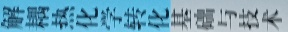

## 文本合成思路

### 1.形式上的模拟

* 竖着的中文与横着的英文

  

  

* 中文和数字的组合形式

_00022.jpg)

_00024.jpg)

* 不同底色的文本拼接

_00053.jpg)

* 汉语文字与标点（闭合标点是横向的）

* 数字与闭合标点

_00019.jpg)

* 带有间隔的文字

_00001.jpg)

* 纯英文，要么横向逐字符排列

  

  要么，竖向 逐语义排列

  这两种情况的英文切出来都是横向的，只是与汉语一起横向排列的切出后是与竖向汉语混在一起的。

* 不同大小文字混合排版

  _00020.jpg)

  

  

  

### 2.逼近原始文本语义